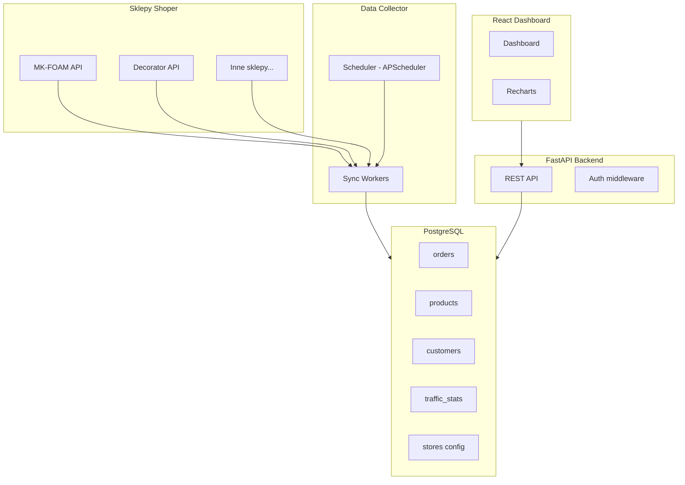

# Shoper Analytics Tool

## Architektura



## Struktura projektu

```
BI_Shoper/
├── backend/
│   ├── app/
│   │   ├── main.py                 # FastAPI app, startup, CORS
│   │   ├── config.py               # Settings (DB URL, API keys)
│   │   ├── database.py             # SQLAlchemy engine + session
│   │   ├── models/                 # SQLAlchemy ORM models
│   │   │   ├── store.py            # Store (multi-sklep config)
│   │   │   ├── order.py            # Orders + order items
│   │   │   ├── product.py          # Products + stock snapshots
│   │   │   ├── customer.py         # Customers
│   │   │   └── traffic.py          # Traffic/visit stats
│   │   ├── routers/                # API endpoints
│   │   │   ├── dashboard.py        # Agregowane KPIs
│   │   │   ├── orders.py           # Zamówienia CRUD + analityka
│   │   │   ├── products.py         # Produkty + bestsellery
│   │   │   ├── customers.py        # Klienci + segmentacja
│   │   │   └── stores.py           # Zarządzanie sklepami
│   │   ├── services/               # Logika biznesowa
│   │   │   ├── shoper_client.py    # Uniwersalny klient Shoper API
│   │   │   ├── sync_service.py     # Synchronizacja danych
│   │   │   └── analytics.py        # Kalkulacje KPI, trendy
│   │   └── scheduler/
│   │       └── jobs.py             # Cykliczne zadania (co godzinę/dzień)
│   ├── alembic/                    # Migracje DB
│   ├── alembic.ini
│   ├── requirements.txt
│   └── .env.example
├── frontend/
│   ├── src/
│   │   ├── App.tsx
│   │   ├── api/
│   │   ├── components/
│   │   │   ├── Layout.tsx
│   │   │   ├── Sidebar.tsx
│   │   │   └── charts/
│   │   ├── pages/
│   │   │   ├── Dashboard.tsx
│   │   │   ├── Orders.tsx
│   │   │   ├── Products.tsx
│   │   │   ├── Customers.tsx
│   │   │   └── Settings.tsx
│   │   └── hooks/
│   ├── package.json
│   └── vite.config.ts
└── README.md
```

## Kluczowe elementy

### 1. Shoper API Client (`shoper_client.py`)
- Uniwersalny klient z obsługą wielu sklepów (token + base_url per store)
- Retry logic, rate limiting, paginacja
- Poprawny format filtrów Shoper: `filters=json.dumps({"field": value})`
- Endpointy: `/orders`, `/products`, `/product-stocks`, `/customers`, `/statuses`, `/order-products`

### 2. Modele PostgreSQL
- **stores** - konfiguracja podłączonych sklepów (nazwa, URL API, token)
- **orders** - zamówienia (id, store_id, date, status, total, customer_id)
- **order_items** - pozycje zamówień (product, qty, price)
- **products** - produkty (code, name, price, stock, category)
- **product_snapshots** - dzienne snapshoty cen/stanów (do trendów)
- **customers** - klienci (email, orders_count, total_spent, first/last_order)
- **traffic_stats** - dzienne statystyki ruchu (visits, unique_visitors, page_views)

### 3. Sync Service (`sync_service.py`)
- Pobiera dane z Shoper API i upsertuje do PostgreSQL
- Tryby: full sync (pierwsze uruchomienie) i incremental (od last_sync_date)
- Scheduler (APScheduler): zamówienia co 1h, produkty co 6h, ruch co 24h

### 4. Analytics API
- `GET /api/dashboard/kpis` - dzienny przychód, zamówienia, avg order value, konwersja
- `GET /api/dashboard/revenue-chart?period=30d` - wykres przychodów
- `GET /api/orders/trends` - trendy zamówień
- `GET /api/products/bestsellers` - top produkty
- `GET /api/customers/segments` - segmentacja RFM

### 5. Frontend - React + Recharts
- Dashboard z KPI cards (przychód, zamówienia, AOV, nowi klienci)
- Wykresy: liniowy przychodu, słupkowy zamówień, pie kategorii
- Tabele: bestsellery, ostatnie zamówienia, top klienci
- Settings: dodawanie/usuwanie sklepów Shoper

## Technologie
- **Backend**: Python 3.12+, FastAPI, SQLAlchemy 2.0, Alembic, APScheduler, httpx
- **Frontend**: React 18, TypeScript, Vite, Recharts, TailwindCSS, Axios
- **DB**: PostgreSQL 15+

## Wazne notatki z migracji Shoper
- Poprawny format filtrow Shoper API: `{"filters": json.dumps({"product_id": 123})}` (NIE `filter[product_id]`)
- Rate limiting: status 429 + header Retry-After
- Paginacja: `limit` + `page`, response ma `count` i `pages`
- Response list format: `d["list"]` moze byc dict lub list
- Tokeny: Bearer token w header Authorization
