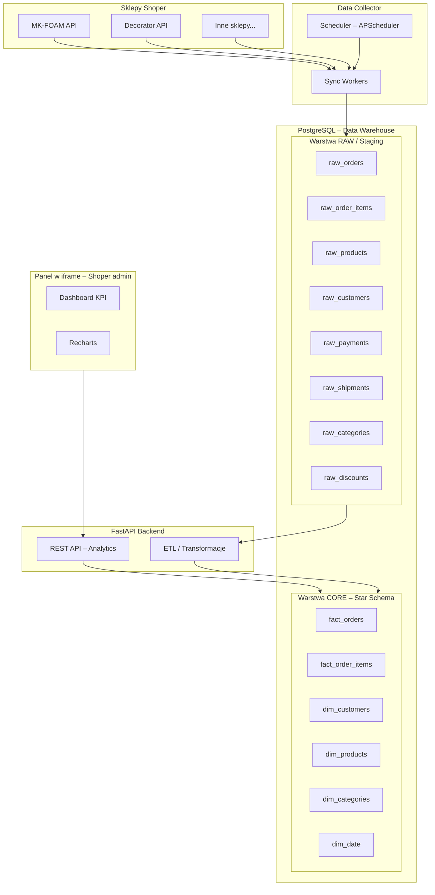

# BI Shoper – Analiza biznesowa sklepów Shoper

## Cel projektu

Hurtownia danych (data warehouse) zasilana z API Shoper, umożliwiająca analizę biznesową:
KPI, konwersję, LTV, RFM, kampanie, marżę, sezonowość, Pareto produktów.

**Osadzanie:** Aplikacja jest osadzana w **panelu administracyjnym Shopera** (iframe po OAuth 2.0), nie na stronie sklepu. Rejestracja w Partner Portal, `panel_url` w manifestie. Szczegóły: `docs/SHOPER_PANEL_APP.md`.

---

## Architektura



---

## Warstwy danych

### Warstwa 1 – RAW (staging)

Tabele 1:1 z odpowiedziami API Shoper. Minimalna transformacja – JSON rozbity na kolumny.
Każda tabela ma pola `updated_at` i `loaded_at`.

| Tabela             | Źródło API Shoper       |
|--------------------|--------------------------|
| `raw_orders`       | `/webapi/rest/orders`    |
| `raw_order_items`  | `/webapi/rest/order-products` |
| `raw_products`     | `/webapi/rest/products`  |
| `raw_customers`    | `/webapi/rest/customers` |
| `raw_payments`     | `/webapi/rest/payments`  |
| `raw_shipments`    | `/webapi/rest/shipments` |
| `raw_categories`   | `/webapi/rest/categories`|
| `raw_discounts`    | `/webapi/rest/discounts` |

Warstwa RAW służy do:
- reimportów i odświeżeń
- debugowania rozbieżności
- audytu danych źródłowych

### Warstwa 2 – CORE (model analityczny, star schema)

Model faktów i wymiarów zoptymalizowany pod zapytania analityczne.

---

## Schemat gwiazdy (star schema)

### Tabele faktów (FACT)

#### `fact_orders` – jedno zamówienie = jeden rekord

```sql
fact_orders (
    order_id                BIGINT PRIMARY KEY,
    store_id                BIGINT,
    customer_id             BIGINT,
    order_date              TIMESTAMP,
    payment_date            TIMESTAMP,
    order_status            VARCHAR(50),
    payment_status          VARCHAR(50),
    shipment_status         VARCHAR(50),

    gross_value             NUMERIC(12,2),
    net_value               NUMERIC(12,2),
    discount_value          NUMERIC(12,2),
    shipping_value          NUMERIC(12,2),
    tax_value               NUMERIC(12,2),
    margin_value            NUMERIC(12,2),

    items_count             INT,

    source_channel          VARCHAR(100),
    campaign                VARCHAR(255),

    created_at              TIMESTAMP,
    updated_at              TIMESTAMP
);
```

**Mierniki:** przychód, średnia wartość koszyka, konwersja, przychód per kanał, marża.

#### `fact_order_items` – każdy produkt w zamówieniu

```sql
fact_order_items (
    order_item_id           BIGINT PRIMARY KEY,
    order_id                BIGINT,
    product_id              BIGINT,
    category_id             BIGINT,

    quantity                INT,
    unit_price_gross        NUMERIC(12,2),
    unit_price_net          NUMERIC(12,2),
    discount_value          NUMERIC(12,2),
    total_gross             NUMERIC(12,2),
    total_net               NUMERIC(12,2),

    order_date              TIMESTAMP
);
```

**Mierniki:** top produkty, analiza kategorii, marża per produkt, Pareto 20/80.

### Tabele wymiarów (DIMENSION)

#### `dim_customers`

```sql
dim_customers (
    customer_id         BIGINT PRIMARY KEY,
    store_id            BIGINT,
    first_order_date    TIMESTAMP,
    last_order_date     TIMESTAMP,
    total_orders        INT,
    total_revenue       NUMERIC(12,2),

    city                VARCHAR(100),
    postal_code         VARCHAR(20),
    country             VARCHAR(100),

    customer_type       VARCHAR(50),   -- new / returning
    rfm_score           VARCHAR(10),

    created_at          TIMESTAMP
);
```

**Mierniki:** LTV, RFM, retencja, segmentacja, kohorty.

#### `dim_products`

```sql
dim_products (
    product_id          BIGINT PRIMARY KEY,
    store_id            BIGINT,
    product_name        VARCHAR(500),
    category_id         BIGINT,
    brand               VARCHAR(255),

    cost_price          NUMERIC(12,2),
    retail_price        NUMERIC(12,2),

    is_active           BOOLEAN,
    created_at          TIMESTAMP
);
```

#### `dim_categories`

```sql
dim_categories (
    category_id     BIGINT PRIMARY KEY,
    category_name   VARCHAR(255),
    parent_id       BIGINT
);
```

#### `dim_date` – wymiar czasu (kluczowy dla analiz)

```sql
dim_date (
    date_id         DATE PRIMARY KEY,
    day             INT,
    month           INT,
    year            INT,
    week            INT,
    quarter         INT,
    is_weekend      BOOLEAN
);
```

**Umożliwia:** sezonowość, trendy, porównania rok do roku, analiza dni tygodnia.

### Relacje

```
fact_orders.customer_id      → dim_customers.customer_id
fact_orders.order_date::date → dim_date.date_id
fact_order_items.order_id    → fact_orders.order_id
fact_order_items.product_id  → dim_products.product_id
dim_products.category_id     → dim_categories.category_id
```

---

## KPI dostępne z tego modelu

| KPI                        | Źródło                       |
|----------------------------|------------------------------|
| Revenue (przychód)         | `fact_orders.gross_value`    |
| Average Order Value (AOV)  | `AVG(fact_orders.gross_value)` |
| Customer LTV               | `dim_customers.total_revenue`|
| Retention rate             | kohorty z `dim_customers`    |
| Konwersja per kanał        | `fact_orders.source_channel` |
| Marża per produkt          | `fact_order_items` + `dim_products.cost_price` |
| Sezonowość                 | `dim_date` + `fact_orders`   |
| Pareto produktów (80/20)   | `fact_order_items` ranking   |
| RFM segmentacja            | `dim_customers.rfm_score`    |
| Top kategorie              | `fact_order_items` + `dim_categories` |

---

## Rozszerzenie PRO – marketing

```sql
fact_marketing (
    marketing_id        BIGINT PRIMARY KEY,
    campaign_name       VARCHAR(255),
    source              VARCHAR(100),
    date                DATE,

    cost                NUMERIC(12,2),
    clicks              INT,
    impressions         INT,
    conversions         INT,
    revenue             NUMERIC(12,2)
);
```

**Dodatkowe KPI:** ROAS, CAC (koszt pozyskania klienta), koszt per konwersja.

---

## Struktura projektu

```
BI_Shoper/
├── backend/
│   ├── app/
│   │   ├── main.py                 # FastAPI app, startup, CORS
│   │   ├── config.py               # Settings (DB URL, API keys)
│   │   ├── database.py             # SQLAlchemy engine + session
│   │   ├── models/
│   │   │   ├── raw/                # Warstwa RAW (staging)
│   │   │   │   ├── raw_orders.py
│   │   │   │   ├── raw_order_items.py
│   │   │   │   ├── raw_products.py
│   │   │   │   ├── raw_customers.py
│   │   │   │   ├── raw_payments.py
│   │   │   │   ├── raw_shipments.py
│   │   │   │   ├── raw_categories.py
│   │   │   │   └── raw_discounts.py
│   │   │   ├── core/               # Warstwa CORE (star schema)
│   │   │   │   ├── fact_orders.py
│   │   │   │   ├── fact_order_items.py
│   │   │   │   ├── dim_customers.py
│   │   │   │   ├── dim_products.py
│   │   │   │   ├── dim_categories.py
│   │   │   │   └── dim_date.py
│   │   │   └── store.py            # Multi-sklep config
│   │   ├── routers/                # API endpoints
│   │   │   ├── dashboard.py        # Agregowane KPIs
│   │   │   ├── orders.py           # Zamówienia + analityka
│   │   │   ├── products.py         # Produkty + bestsellery
│   │   │   ├── customers.py        # Klienci + segmentacja
│   │   │   └── stores.py           # Zarządzanie sklepami
│   │   ├── services/
│   │   │   ├── shoper_client.py    # Uniwersalny klient Shoper API
│   │   │   ├── sync_service.py     # RAW: pobieranie z API → staging
│   │   │   ├── transform.py        # ETL: RAW → CORE (star schema)
│   │   │   └── analytics.py        # Kalkulacje KPI, RFM, LTV
│   │   └── scheduler/
│   │       └── jobs.py             # Cykliczne zadania sync + transform
│   ├── scripts/
│   │   ├── create_database.py      # Tworzenie bazy PostgreSQL
│   │   ├── view_database.py        # Podgląd tabel i danych
│   │   └── seed_dim_date.py        # Wypełnienie dim_date
│   ├── alembic/                    # Migracje DB
│   ├── alembic.ini
│   ├── requirements.txt
│   └── .env.example
├── analytics-embed/                # Panel w iframe (Shoper admin), nie strona sklepu
│   ├── src/
│   │   ├── App.tsx
│   │   ├── components/
│   │   │   └── charts/
│   │   └── pages/
│   │       ├── Dashboard.tsx       # KPI cards + wykresy
│   │       ├── Orders.tsx          # Analiza zamówień
│   │       ├── Products.tsx        # Bestsellery, Pareto
│   │       ├── Customers.tsx       # RFM, LTV, kohorty
│   │       └── Settings.tsx        # Sklepy / OAuth status
│   ├── package.json
│   └── vite.config.ts
├── PLAN.md
└── README.md
```

---

## Pipeline danych (ETL)

```
API Shoper  →  Sync Service  →  RAW (staging)  →  Transform  →  CORE (star schema)  →  API  →  Dashboard
```

1. **Sync** – pobiera dane z API Shoper, zapisuje do tabel `raw_*`
2. **Transform** – przetwarza RAW → CORE (deduplikacja, agregacja, kalkulacja RFM/LTV)
3. **API** – serwuje dane z CORE do panelu (iframe w panelu admin Shoper)

### Harmonogram (scheduler)

| Zadanie               | Częstotliwość | Opis                                    |
|-----------------------|---------------|-----------------------------------------|
| sync_orders           | co 1h         | Nowe/zmienione zamówienia → raw_orders  |
| sync_products         | co 6h         | Produkty + stany → raw_products         |
| sync_customers        | co 6h         | Klienci → raw_customers                 |
| transform_core        | co 1h         | RAW → CORE (po sync_orders)             |
| refresh_rfm           | co 24h        | Przeliczenie RFM i segmentacji          |
| refresh_dim_date      | co 24h        | Uzupełnienie dim_date o nowe dni        |

---

## Technologie

- **Backend**: Python 3.12+, FastAPI, SQLAlchemy 2.0 (async), Alembic, APScheduler, httpx
- **Frontend**: React 18, TypeScript, Vite, Recharts, TailwindCSS, Axios
- **DB**: PostgreSQL 15+
- **ETL**: Python (SQLAlchemy transforms, bez zewnętrznych narzędzi ETL)

---

## Notatki techniczne – Shoper API

- Format filtrów: `{"filters": json.dumps({"product_id": 123})}` (NIE `filter[product_id]`)
- Rate limiting: status 429 + header `Retry-After`
- Paginacja: `limit` + `page`, response zawiera `count` i `pages`
- Response list: `d["list"]` może być dict lub list
- Auth: Bearer token w header `Authorization`
- Endpointy: `/orders`, `/products`, `/product-stocks`, `/customers`, `/statuses`, `/order-products`

---

## Status realizacji

- [x] Plan i architektura
- [x] Backend: config, database
- [x] Backend: Shoper API client (z retry/pagination)
- [x] Backend: sync service (podstawowy) – zapis do tabel legacy (orders, products, customers)
- [x] Backend: analytics service + API routes (podstawowe)
- [x] Backend: scheduler (orders/1h, products/6h, customers/24h, reference/24h, transform/1h)
- [x] **Modele RAW + CORE (star schema)** – tabele w DB gotowe
- [x] **Sync → RAW** – sync_service zapisuje do raw_orders, raw_order_items, raw_products, raw_customers + referencyjne (payments, shipments, categories, statuses, discounts)
- [x] **ETL: transform service** – RAW → CORE (fact_orders, fact_order_items, dim_customers, dim_products, dim_categories)
- [x] Skrypt seed_dim_date (auto-seed na starcie + do ręcznego uruchomienia)
- [x] Zadanie scheduler: transform_core (1h), refresh_dim_date (auto-seed)
- [x] **Data quality** – parsowanie dat Shoper, konwersja bool '0'/'1', status z raw_statuses, payment_date z status_date
- [x] **Analytics API** – endpointy na CORE: /analytics/overview, /revenue, /top-products, /customers
- [ ] Kalkulacje RFM / LTV (analytics)
- [ ] Alembic migracje
- [ ] **OAuth 2.0 + Partner API** – callback, przechowywanie tokenów per sklep (zob. docs/SHOPER_PANEL_APP.md)
- [x] Panel (analytics-embed): scaffold Vite + React
- [ ] Panel: strony (Dashboard, Orders, Products, Customers), wykresy
- [ ] Panel: identyfikacja sklepu z iframe (parametr shop / kontekst OAuth)
- [ ] Rozszerzenie PRO: fact_marketing
