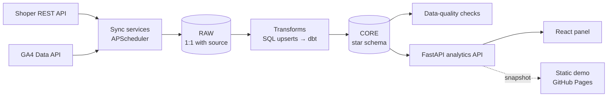

# BI Shoper

A data engineering portfolio project built around e-commerce data from [Shoper](https://www.shoper.pl/) stores:
API ingestion, a RAW → CORE warehouse in PostgreSQL, versioned schema migrations, reproducible synthetic data,
and SQL data-quality checks that reconcile numbers across sources. A small React panel sits on top so the
results can be clicked through.

<!-- TODO(you): 2-4 sentences on how this repo relates to the production app in the private repo. -->

**Live demo: https://mxsgd.github.io/BI_Shoper/** — the panel running on a frozen snapshot of a synthetic store
(details [below](#live-demo)).

## What it demonstrates

- **Ingestion from two APIs.** Paginated, rate-limited Shoper REST client with retries and token refresh
  ([`shoper_client.py`](backend/app/services/shoper_client.py), [`sync_service.py`](backend/app/services/sync_service.py));
  GA4 Data API reports ([`ga4_client.py`](backend/app/services/ga4_client.py)). Incremental and full sync run on a schedule.
- **Layered warehouse.** RAW tables mirror the source 1:1 for traceability; CORE is a star schema
  (`fact_orders`, `fact_order_items`, `dim_customers`, `dim_products`, `dim_categories`, `dim_date`) built by idempotent
  `INSERT … ON CONFLICT` transforms ([`transform_service.py`](backend/app/services/transform_service.py)).
- **Multi-tenant keys.** Every Shoper shop numbers its orders and products from 1, so CORE is keyed by
  `(store_id, shoper_id)`. A test clones a store with identical ids and checks neither store's numbers move
  ([`test_multi_store.py`](backend/tests/data_quality/test_multi_store.py)).
- **Schema as code.** Alembic owns the schema. CI builds a fresh database, runs every migration up and down, and
  fails if the models and migrations disagree (`alembic check`). Existing data was migrated in place
  ([`0002_store_scoped_core_keys.py`](backend/alembic/versions/0002_store_scoped_core_keys.py)).
- **Reproducible test data.** A deterministic generator produces a synthetic store from one causal chain
  (sessions → orders → order lines → GA4 funnel → tracker events), so cross-source numbers reconcile the way they
  would for a correctly instrumented shop ([`app/demo`](backend/app/demo)).
- **Data quality as SQL.** Keys, referential integrity, validity, RAW-vs-CORE and GA4-vs-orders reconciliation, and
  freshness, each with an explicit tolerance ([`checks.py`](backend/app/quality/checks.py)). They run in CI against the
  synthetic store and work as a health report against a real one.
- **Analytics on top.** Revenue, cohorts and retention, RFM segmentation, channels, funnel
  ([`analytics_core`](backend/app/services/analytics_core)).

In progress: moving the RAW → CORE transforms to [dbt](dbt/) (sources and freshness declared, models next).

## Architecture


```mermaid
graph LR
    S[Shoper REST API] --> I[Sync services<br/>APScheduler]
    G[GA4 Data API] --> I
    I --> R[(RAW<br/>1:1 with source)]
    R --> T[Transforms<br/>SQL upserts → dbt]
    T --> C[(CORE<br/>star schema)]
    C --> Q[Data-quality checks]
    C --> A[FastAPI analytics API]
    A --> P[React panel]
    A -. snapshot .-> D[Static demo<br/>GitHub Pages]
```

PostgreSQL holds both layers; Alembic manages the schema. Each request acts only for the store in its signed
Shoper session, so one deployment can serve several shops.

## Data quality

```bash
cd backend
python -m app.demo          # seed a synthetic store into <your db>_demo and run the pipeline
python -m app.quality       # run every check against DATABASE_URL (exit 1 on failure)
python -m pytest            # seeds a test database, runs the checks, the pipeline and API tests
```

The checks target failure modes typical of sync-and-transform pipelines: source rows replaced on re-sync while the
warehouse keeps stale copies, unit mismatches between systems (epoch seconds vs milliseconds), and tracking that
silently undercounts (GA4 or tracker purchases vs real orders). The seeder refuses any database whose name does not
end in `_demo` or `_test`, and the same seed always produces identical data (`--seed`, `--days`, `--as-of`).

## Live demo

https://mxsgd.github.io/BI_Shoper/ runs the real React panel with no backend behind it. Period filters, grouping and
click-a-day focus work, but they read pre-generated JSON instead of calling the API, and the write features (price
updates, variant codes, settings) are left out. [`pages.yml`](.github/workflows/pages.yml) rebuilds it on every push
to `main`: seed the synthetic store into a throwaway Postgres, freeze every API response the UI can request
(`python -m app.demo.snapshot`, ~1,500 files), build the frontend with `npm run build:demo`, deploy.

## Running locally

Requires Python 3.12+, PostgreSQL 15+ and Node.js 18+.

```bash
cd backend
python -m venv .venv
.venv\Scripts\activate          # or: source .venv/bin/activate
pip install -r requirements.txt
cp .env.example .env            # set DATABASE_URL and DEV_STORE_ID=1
python -m alembic upgrade head
uvicorn app.main:app --reload --port 8000
```

```bash
cd analytics-embed
npm install
npm run dev
```

On Windows, `dev.bat` in the repo root runs migrations and starts both. API docs are at http://localhost:8000/docs.

Outside the Shoper admin there is no session cookie, so `DEV_STORE_ID` makes requests from your own machine act as
that store. It is ignored for requests from anywhere else; never set it on a deployed server.

## Tech stack

Python, FastAPI, SQLAlchemy, Alembic, APScheduler, PostgreSQL, dbt (in progress), pytest, GitHub Actions ·
React, TypeScript, Vite, Tailwind CSS, Recharts · Shoper REST API, Google Analytics 4 Data API

## Repository structure

```text
backend/            ingestion, transforms, data-quality checks, analytics API, Alembic migrations, tests
analytics-embed/    React panel (also built as the static demo)
dbt/                dbt project for the RAW -> CORE transforms (in progress)
tracker/            storefront event tracker (demo data only)
docs/               Shoper integration, API reference, database management
```

More detail: [`docs/DB_MANAGEMENT.md`](docs/DB_MANAGEMENT.md) (migrations, schema),
[`docs/SHOPER_APPSTORE_INTEGRATION.md`](docs/SHOPER_APPSTORE_INTEGRATION.md) (OAuth install flow, iframe sessions),
[`docs/ShoperAPI-Reference.md`](docs/ShoperAPI-Reference.md).

## License

Proprietary, all rights reserved. See [`LICENSE`](LICENSE).
